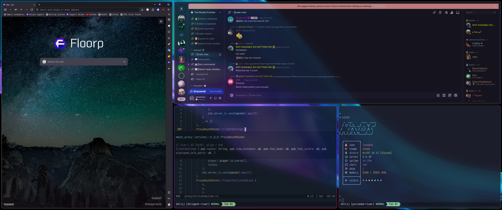

# Janot's dotfiles

My configuration files for NixOS, Hyprland, Neovim, and more.

## Setup

*I'm assuming you're running NixOS*

Clone this repository and run the utility `setup.sh` script I wrote because I'm lazy.
